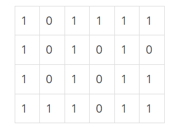

## 미로 탐색(실버1) - 백준(2178번-BFS)
```
*** 문제 풀이 ***
DFS보다 BFS가 탐색이 이 문제에 더 적합한 이유는 BFS는 해당 깊이에서 갈 수 있는 노드 탐색을
마친 후 다음 깊이로 넘어간다.
즉, 찾는 순간 바로 탐색으로 결과를 찾을 수 있기 때문에 DFS보다 적합하다.
물론 DFS 방식으로 문제를 해결해도 되지만 DFS 방식은 다시 뒤로 돌아가서 다시 찾는 과정을 거쳐야 한다.
```
`[시간제한(1초) | 메모리 제한(192 MB)]`

### > 문제
N×M크기의 배열로 표현되는 미로가 있다.



미로에서 1은 이동할 수 있는 칸을 나타내고, 0은 이동할 수 없는 칸을 나타낸다. 
이러한 미로가 주어졌을 때, (1, 1)에서 출발하여 (N, M)의 위치로 이동할 때 지나야 하는 최소의 칸 수를 구하는 프로그램을 작성하시오. 한 칸에서 다른 칸으로 이동할 때, 서로 인접한 칸으로만 이동할 수 있다.

위의 예에서는 15칸을 지나야 (N, M)의 위치로 이동할 수 있다. 
칸을 셀 때에는 시작 위치와 도착 위치도 포함한다.

### > 입력
첫째 줄에 두 정수 N, M(2 ≤ N, M ≤ 100)이 주어진다. 다음 N개의 줄에는 M개의 정수로 미로가 주어진다. 
각각의 수들은 붙어서 입력으로 주어진다.

### > 출력
첫째 줄에 지나야 하는 최소의 칸 수를 출력한다. 항상 도착위치로 이동할 수 있는 경우만 입력으로 주어진다.

#### 예제 입력1
```
4 6
101111
101010
101011
111011
```
#### 예제 출력1
```
15
```
<hr style="border: none; border-top: 1px solid lavender;" />

#### 예제 입력2
```
4 6
110110
110110
111111
111101
```

#### 예제 출력2
```
9
```
<hr style="border: none; border-top: 1px solid lavender;" />

#### 예제 입력3
```
2 25
1011101110111011101110111
1110111011101110111011101
```

#### 예제 출력3
```
38
```
<hr style="border: none; border-top: 1px solid lavender;" />

#### 예제 입력4
```
7 7
1011111
1110001
1000001
1000001
1000001
1000001
1111111
```

#### 예제 출력4
```
13
```
 
