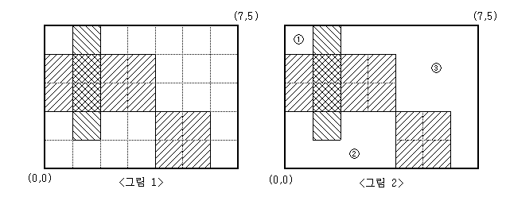

## 영역 구하기(실버1) - 백준(2583번-DFS)
```
*** 문제 풀이 ***
Stack 또는 재귀함수를 통해 DFS 방식으로 빈곳이면서 탐색하지 않은 위치일 때 DFS 탐색을 통해
해당 구역에 정사각형 개수를 구한다.

이 문제에서 어려웠던 부분은 탐색알고리즘보다 해당 문제에서 입력받는 값을 가지고 2차원 배열로 표시하는부분에서
어려움을 겪었고 [1] - (x,y)가 아닌 (y,x)과 [2] - 마지막에 입력받은 x,y는 포함하지 않는 범위까지 체크를 하는것
이 2가지가 문제를 해결하는데 개인적으로 가장 어려운 부분이었다.

Stack과 재귀함수 2가지 모두 처리시간은 비슷했다.
```
`[시간제한(1초) | 메모리 제한(128 MB)]`

### > 문제
눈금의 간격이 1인 M×N(M,N≤100)크기의 모눈종이가 있다. 이 모눈종이 위에 눈금에 맞추어 K개의 직사각형을 그릴 때, 이들 K개의 직사각형의 내부를 제외한 나머지 부분이 몇 개의 분리된 영역으로 나누어진다.

예를 들어 M=5, N=7 인 모눈종이 위에 <그림 1>과 같이 직사각형 3개를 그렸다면, 그 나머지 영역은 <그림 2>와 같이 3개의 분리된 영역으로 나누어지게 된다.



<그림 2>와 같이 분리된 세 영역의 넓이는 각각 1, 7, 13이 된다.

M, N과 K 그리고 K개의 직사각형의 좌표가 주어질 때, K개의 직사각형 내부를 제외한 나머지 부분이 몇 개의 분리된 영역으로 나누어지는지, 그리고 분리된 각 영역의 넓이가 얼마인지를 구하여 이를 출력하는 프로그램을 작성하시오.

### > 입력
첫째 줄에 M과 N, 그리고 K가 빈칸을 사이에 두고 차례로 주어진다. M, N, K는 모두 100 이하의 자연수이다. 둘째 줄부터 K개의 줄에는 한 줄에 하나씩 직사각형의 왼쪽 아래 꼭짓점의 x, y좌표값과 오른쪽 위 꼭짓점의 x, y좌표값이 빈칸을 사이에 두고 차례로 주어진다. 모눈종이의 왼쪽 아래 꼭짓점의 좌표는 (0,0)이고, 오른쪽 위 꼭짓점의 좌표는(N,M)이다. 입력되는 K개의 직사각형들이 모눈종이 전체를 채우는 경우는 없다.

### > 출력
첫째 줄에 분리되어 나누어지는 영역의 개수를 출력한다. 둘째 줄에는 각 영역의 넓이를 오름차순으로 정렬하여 빈칸을 사이에 두고 출력한다.

#### 예제 입력1
```
5 7 3
0 2 4 4
1 1 2 5
4 0 6 2
```
#### 예제 출력1
```
3
1 7 13
```